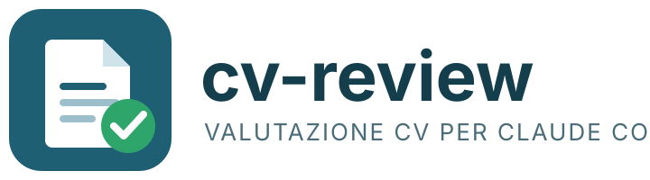

# cv-review

Una skill per [Claude Code](https://claude.com/claude-code) che valuta curriculum vitae in modo
**confrontabile**, **tracciabile** e **non discriminatorio**: stessa rubrica per tutti i CV, ogni
giudizio cita il CV, i dati protetti (età, genere, foto, stato civile, nazionalità...) vengono
dichiarati e ignorati.

La skill vive in `.claude/skills/cv-review/` e si attiva da sola quando in Claude Code, aperto
in questo repository, si chiede di valutare, confrontare o classificare dei CV.

## Da cosa parte l'analisi

L'analisi parte da due input:

1. **Uno o più CV** in PDF, DOCX, HTML, Markdown o testo. I PDF scansionati senza layer di testo
   non sono supportati: la skill lo segnala e si ferma.
2. **Una job description** (o un elenco di requisiti). Se manca, la skill la chiede oppure la ricava
   dalla richiesta e dichiara nel report quali requisiti ha usato. Se la richiesta è solo
   "com'è fatto questo CV", la parte di aderenza al ruolo viene saltata.

Da qui la procedura è sempre la stessa:

| Passo | Cosa succede | Strumento |
|-------|--------------|-----------|
| 1 | Estrazione del testo dal CV | `scripts/extract_text.py` |
| 2 | Rendering delle pagine in PNG, con font, dimensioni e margini rilevati | `scripts/render_pages.py` |
| 3 | Separazione dei requisiti in obbligatori e graditi | JD |
| 4 | Elenco dei dati protetti presenti nel CV, che non verranno usati | `rubric.md` |
| 5 | Compilazione della rubrica, tre blocchi | `rubric.md` |
| 6 | Calcolo punteggi e decisione | `rubric.md` |
| 7 | Report a sezioni fisse in `<nome-cv>-valutazione.md`; con più CV anche `ranking.md` | `report-template.md` |
| 8 | PDF del report con copertina (logo, posizione, data, nota sull'analisi IA), intestazione, piè di pagina, link alla skill e "Pagina X di Y" | `scripts/report_to_pdf.py` |
| 9 | *Opzionale, su richiesta:* riscrittura del CV in una versione monopagina mirata | `rewrite-guide.md` |

### I tre blocchi della rubrica

- **Blocco A – Aderenza al ruolo.** È l'unico che decide. Prima un *gate* sui requisiti
  obbligatori (ogni requisito ha uno stato: `Verificato`, `Dedotto`, `Non verificabile`,
  `Assente`, con citazione dal CV), poi cinque criteri pesati con livelli ancorati 0–4:
  esperienza pertinente, competenze richieste, risultati dimostrati, crescita, formazione.
  Il punteggio va da 0 a 100 e, insieme al gate, produce la decisione: *Chiamare*, *Chiamare se
  ci sono posti*, *Chiamare per verificare*, *Non procedere*.
- **Blocco B – Contenuto del CV.** Checklist in 15 voci su come è scritto il documento: contatti,
  About Me, esperienze con date e risultati, competenze ordinate e non gonfiate, soft skill reali,
  certificazioni, lingue, hobby, autorizzazione al trattamento dati.
- **Blocco C – Grafica e tipografia.** Checklist in 14 voci compilata solo guardando le pagine
  renderizzate: allineamento a sinistra, niente giustificato, margini, spaziatura gerarchica,
  orfani e vedove, massimo due typeface, grassetto parco, un solo colore.

B e C misurano il documento, non la persona: **non entrano nella decisione né nel ranking**.
Servono come informazione e come feedback da restituire al candidato.

### La riscrittura del CV (fase 9, opzionale)

La valutazione si ferma al passo 8. Se il candidato lo chiede — e solo allora — la skill usa il
report appena prodotto per riscrivere il CV in **una pagina mirata a una posizione**.

Cambia l'interlocutore: nei passi 1–8 si risponde a chi seleziona, nella fase 9 a chi si candida.

1. **Target**: la posizione valutata, un altro ruolo, o una versione generale.
2. **Intervista**: al massimo dieci domande, ricavate solo dalle righe incerte del report — un
   requisito `Non verificabile` del gate, una competenza `Dedotto`, un criterio senza numeri, una
   voce di contenuto mancante. Le voci che il tetto di dieci taglia fuori vengono dichiarate prima
   di cominciare, non scoperte a CV finito.
3. **Scaletta**: cosa entra, cosa si comprime a una riga, cosa si taglia e perché. La skill si
   ferma qui finché la scaletta non è approvata: tagliare è la decisione che fa il CV monopagina.
4. **Stesura e impaginazione**: `.md`, `.docx` modificabile e `.pdf` da inviare, verificato su una
   pagina. Il PDF non porta logo né piè di pagina della skill: è il CV del candidato.
5. **Note**: un file a parte con la mappa origine → riga, cosa verificare prima di inviare e cosa
   resta scoperto. Non fa parte del CV e non va inviato.

Le regole che rendono il risultato utilizzabile:

- Nel CV entra **solo** ciò che è nel CV originale o in una risposta del candidato. Niente
  inferenze, niente numeri plausibili, niente verbi rafforzati.
- **Niente segnaposto**: se un dato manca, la voce si riscrive senza quel dato o si taglia. Il CV
  esce pronto da inviare e le lacune finiscono nelle note.
- Un intervallo non diventa il suo estremo comodo: o il numero esatto, o nessuna cifra.
- Per stare in una pagina si toglie contenuto. Sotto corpo 10 pt, interlinea 1.0 e margini 18 mm
  non si scende: comprimere un CV fino a renderlo illeggibile è la voce C9 che la rubrica misura.
- Sul CV riscritto si ricompilano **le voci** B e C, non i punteggi: un punteggio sul documento
  appena scritto misura la stessa checklist usata per scriverlo.
- **Riscrivere il CV non migliora il candidato.** Il blocco A cambia solo se una risposta
  dell'intervista copre un requisito: in quel caso la riga passa allo stato `Dichiarato`.

### Gli stati dell'evidenza

Ogni riga del blocco A porta uno stato e una citazione:

| Stato | Significato |
|-------|-------------|
| `Verificato` | Scritto esplicitamente nel CV, in un'esperienza o formazione datata |
| `Dichiarato` | Affermato dal candidato rispondendo a una domanda, ma assente dal CV |
| `Dedotto` | Plausibile da ciò che è scritto, ma non esplicito |
| `Non verificabile` | Il CV non dice nulla e non c'è base per dedurlo |
| `Assente` | Il CV contraddice il requisito o mostra che manca |

`Dichiarato` non compare nello screening ordinario, dove l'unica fonte è il documento: nasce dalle
risposte dirette del candidato. È più forte di `Dedotto`, perché non è un'inferenza di chi valuta,
e più debole di `Verificato`, perché nessun documento lo sostiene — per questo un requisito coperto
solo da `Dichiarato` fa passare il gate ma resta sempre una domanda per il colloquio.

### Regole di garanzia

- Gap temporali e cambi frequenti di lavoro non pesano mai: diventano domande neutre per il colloquio.
- Sede e disponibilità si leggono solo da dichiarazioni esplicite del CV, mai dal luogo di nascita.
- Una skill elencata ma mai usata in un'esperienza vale al massimo `Dedotto`.
- Le domande di verifica sono al massimo cinque, ognuna legata a un'evidenza incerta del report.
- Con più CV, il ranking si fa solo dopo aver compilato tutte le rubriche con gli stessi pesi.

## Fonti

I criteri dei blocchi B e C non sono inventati: vengono da due guide pubbliche per sviluppatori
sul mercato del lavoro italiano.

| Blocco | Fonte | Autore | Licenza |
|--------|-------|--------|---------|
| B – Contenuto | [Guida Galattica per il CV](https://github.com/GuidoPenta/galactic-CV-guide-for-developers) | Guido Penta | MIT |
| C – Grafica e tipografia | [Your CV looks like sh*t – Easy fixes for typographic redemption](https://github.com/SimonDiff/devs-cv-typography-guidelines) | Simon Di Fresco | CC0 1.0 |

Il blocco A (aderenza al ruolo, pesi, regola di decisione) è una rubrica di screening classica
scritta per questo progetto.

## Come provare la skill

### Prerequisiti

- Claude Code
- Python 3.10+ con `pymupdf` e `python-docx` (`pip install pymupdf python-docx`)
- `pandoc` e LibreOffice: servono per il PDF del report e per il rendering grafico dei DOCX
- Senza pandoc o LibreOffice la valutazione resta in Markdown; senza LibreOffice i DOCX si valutano solo sul contenuto e il blocco grafico risulta `N/A`

I CV reali e le valutazioni vanno nella cartella `cv/`, esclusa da git: contengono dati personali.

### Prova rapida con gli esempi inclusi

La cartella `examples/` contiene un CV fittizio (Mario Rossi, in `.pdf`, `.docx` e `.md`) e una
job description per un Senior Backend Engineer. Il CV è volutamente imperfetto: dati personali
superflui, elenco competenze gonfiato, profilo con frasi vuote, inglese "buono" dove la JD chiede
"fluente".

1. Apri Claude Code nella radice del repository:
   ```
   claude
   ```
2. Chiedi una valutazione, per esempio:
   ```
   Valuta examples/cv_mario_rossi.pdf per la posizione in examples/jd_senior_backend.md
   ```
   oppure invoca la skill direttamente:
   ```
   /cv-review examples/cv_mario_rossi.pdf examples/jd_senior_backend.md
   ```
3. Il risultato atteso è un report con decisione in testa, gate sui requisiti obbligatori, le tre
   tabelle A/B/C, punti di forza, rischi, domande per il colloquio e feedback sul documento.
   Sull'esempio incluso la decisione attesa è **Chiamare per verificare**: il gate resta aperto
   sull'inglese, mentre il punteggio di aderenza è alto.
4. Accanto al CV trovi `cv_mario_rossi-valutazione.md` e `cv_mario_rossi-valutazione.pdf`. Il PDF
   inizia con una copertina (logo, candidato, posizione e data, nota sull'analisi tramite IA, riferimenti
   al progetto open source MIT); nelle pagine del report, logo e titolo in intestazione e nel piè di
   pagina il link alla skill, la data e il numero di pagina.

Altre prove utili:

```
Com'è fatto questo CV? examples/cv_mario_rossi.pdf
```
compila solo i blocchi B e C, senza job description.

```
Ora riscrivimi il CV in una pagina per quella posizione
```
avvia la fase 9: qualche domanda, una scaletta da approvare, poi
`cv_mario_rossi-riscritto.md`, `.docx`, `.pdf` e `-riscritto-note.md`.

```
Confronta i CV nella cartella candidati/ per la posizione in jd.md e fammi una shortlist
```
produce un report per CV più `ranking.md`.

### Provare gli script da soli

```
python .claude/skills/cv-review/scripts/extract_text.py examples/cv_mario_rossi.pdf
python .claude/skills/cv-review/scripts/render_pages.py examples/cv_mario_rossi.pdf --out render
python .claude/skills/cv-review/scripts/report_to_pdf.py report.md --out report.pdf --cv "cv_mario_rossi.pdf"
python .claude/skills/cv-review/scripts/cv_to_pdf.py cv-riscritto.md --compact
```

Il primo stampa il testo del CV; il secondo scrive `render/cv_mario_rossi-p1.png` e stampa
numero di pagine, font usati, dimensioni e margini; il terzo trasforma un report Markdown scritto
con il template della skill nel PDF ufficiale; il quarto impagina un CV riscritto in `.docx` e
`.pdf` e riporta pagine e riempimento, uscendo con codice 2 se supera una pagina. Le cartelle
`render/` e `cv_text/` sono in `.gitignore`.

### Usare la skill in un altro progetto

Copia la cartella `.claude/skills/cv-review/` nella cartella `.claude/skills/` del progetto,
oppure in `~/.claude/skills/` per averla disponibile ovunque.

## Struttura del repository

```
.claude/skills/cv-review/
  SKILL.md              procedura, regole fisse, errori comuni
  rubric.md             blocchi A, B, C, stati dell'evidenza, calcolo, decisione
  report-template.md    template report singolo e tabella ranking
  rewrite-guide.md      fase 9: integrità, domande, tagli, verifica
  cv-template.md        struttura del CV monopagina
  scripts/
    extract_text.py     CV -> testo
    render_pages.py     CV -> PNG per pagina + dati tipografici
    report_to_pdf.py    report .md -> PDF con copertina, logo, intestazione, piè di pagina
    cv_to_pdf.py        CV riscritto .md -> .docx + .pdf su una pagina, senza marchi
  assets/
    logo.svg, logo.png  logo del progetto
cv/                     CV reali e valutazioni (in .gitignore)
examples/
  cv_mario_rossi.{pdf,docx,md}
  jd_senior_backend.md
```
